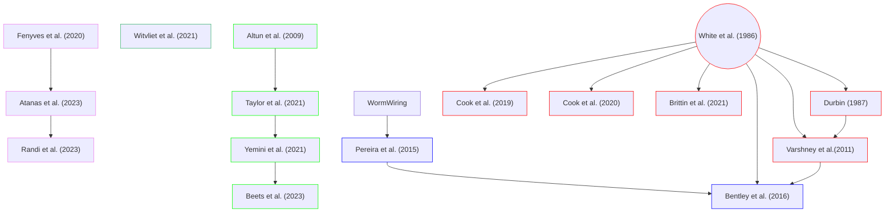

```mermaid
flowchart TD
    classDef anat stroke:#f00
    classDef gene stroke:#0f0
    classDef es stroke:#00f
    classDef func stroke:#ee82ee
    classDef dev stroke:#3cb371

    H["Fenyves et al. (2020)"]:::func --> O["Atanas et al. (2023)"]:::func
    O --> P["Randi et al. (2023)"]:::func    
    K["Witvliet et al. (2021)"]:::dev
    E["Pereira et al. (2015)"]:::es --> F["Bentley et al. (2016)"]:::es

    C["Altun et al. (2009)"]:::gene --> L["Taylor et al. (2021)"]:::gene
    L --> M["Yemini et al. (2021)"]:::gene
    M --> N["Beets et al. (2023)"]:::gene

    A(("White et al. (1986)")):::anat --> B["Durbin (1987)"]:::anat
    classDef anatomical fill:#f93
    A --> D["Varshney et al.(2011)"]:::anat
    B --> D
    A --> G["Cook et al. (2019)"]:::anat
    A --> I["Cook et al. (2020)"]:::anat
    A --> J["Brittin et al. (2021)"]:::anat
    A --> F
    D --> F
    DB1["WormWiring"] --> E

```
