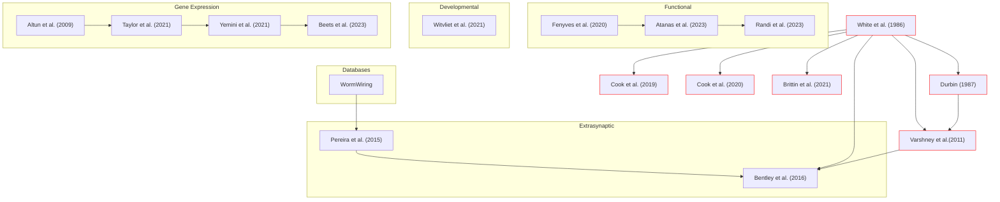

```mermaid
flowchart TD
    classDef anat stroke:#f00
    classDef gene stroke:#0f0
    classDef es stroke:#00f

    subgraph Functional
    H["Fenyves et al. (2020)"] --> O["Atanas et al. (2023)"]
    O --> P["Randi et al. (2023)"]
    end
    subgraph Developmental
    K["Witvliet et al. (2021)"]
    end
    subgraph Extrasynaptic
    E["Pereira et al. (2015)"] --> F["Bentley et al. (2016)"]
    end
    subgraph Gene Expression
    C["Altun et al. (2009)"] --> L["Taylor et al. (2021)"]
    L --> M["Yemini et al. (2021)"]
    M --> N["Beets et al. (2023)"]
    end
    A["White et al. (1986)"]:::anat --> B["Durbin (1987)"]:::anat
    classDef anatomical fill:#f93
    A --> D["Varshney et al.(2011)"]:::anat
    B --> D
    A --> G["Cook et al. (2019)"]:::anat
    A --> I["Cook et al. (2020)"]:::anat
    A --> J["Brittin et al. (2021)"]:::anat
    A --> F
    D --> F
    subgraph Databases
    DB1["WormWiring"] --> E
    end
```
