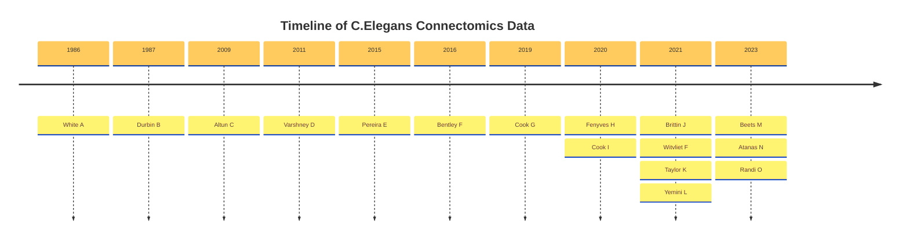

```mermaid
flowchart TD
    c1-->a2
    subgraph Functional
    H["Fenyves et al. (2020)"]
    end
    subgraph Developmental
    b1-->b2
    end
    subgraph Extrasynaptic
    E["Pereira et al. (2015)"] --> F["Bentley et al. (2016)"]
    end
    subgraph Gene Expression
    C["Altun et al. (2009)"] --> 
    end
    subgraph Anatomical
    A["White et al. (1986)"] --> B["Durbin (1987)"]
    A --> D["Varshney et al.(2011)"]
    A --> G["Cook et al. (2019)"]
    A --> I["Cook et al. (2020)"]
    end
```
