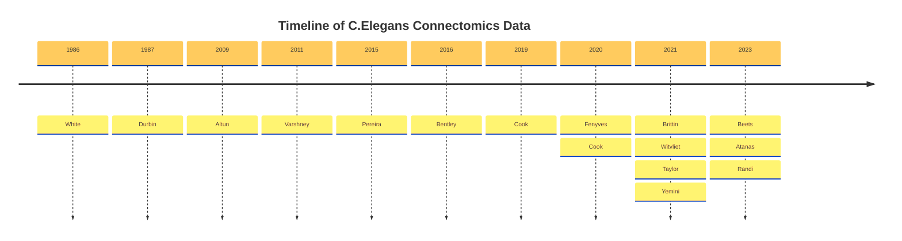
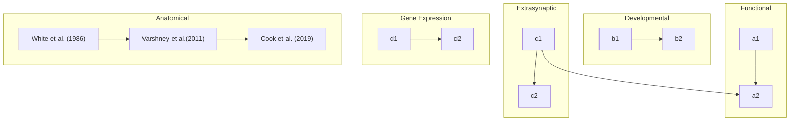

```mermaid
%%{init: { 'logLevel': 'debug', 'theme': 'base', 'timeline': {'disableMulticolor': true}}}%%
  timeline
    title Timeline of C.Elegans Connectomics Data
    1986 : White
    1987 : Durbin
    2009 : Altun
    2011 : Varshney
    2015 : Pereira
    2016 : Bentley
    2019 : Cook
    2020 : Fenyves
         : Cook
    2021 : Brittin
         : Witvliet
         : Taylor
         : Yemini
    2023 : Beets
         : Atanas
         : Randi
```

```mermaid
flowchart TB
    c1-->a2
    subgraph Functional
    a1-->a2
    end
    subgraph Developmental
    b1-->b2
    end
    subgraph Extrasynaptic
    c1-->c2
    end
    subgraph Gene Expression
    d1 -->d2
    end
    subgraph Anatomical
    D["White et al. (1986)"] --> E["Varshney et al.(2011)"]
    E --> f["Cook et al. (2019)"]
    end
```
