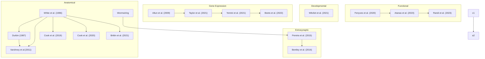

```mermaid
flowchart TD
    c1-->a2
    subgraph Functional
    H["Fenyves et al. (2020)"] --> O["Atanas et al. (2023)"]
    O --> P["Randi et al. (2023)"]
    end
    subgraph Developmental
    K["Witvliet et al. (2021)"]
    end
    subgraph Extrasynaptic
    E["Pereira et al. (2015)"] --> F["Bentley et al. (2016)"]
    end
    subgraph Gene Expression
    C["Altun et al. (2009)"] --> L["Taylor et al. (2021)"]
    L --> M["Yemini et al. (2021)"]
    M --> N["Beets et al. (2023)"]
    end
    subgraph Anatomical
    A["White et al. (1986)"] --> B["Durbin (1987)"]
    A --> D["Varshney et al.(2011)"]
    B --> D
    A --> G["Cook et al. (2019)"]
    A --> I["Cook et al. (2020)"]
    A --> J["Brittin et al. (2021)"]
    DB1["Wormwiring"] --> E
    end
```
